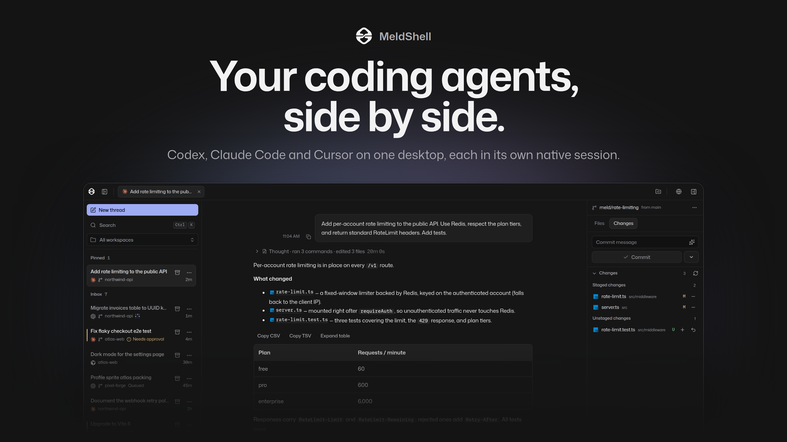
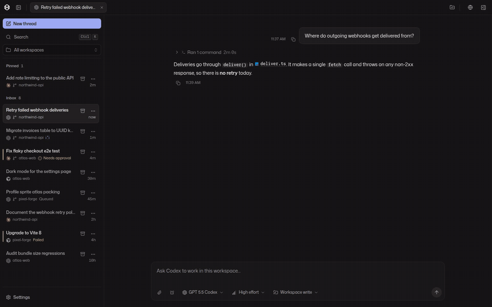
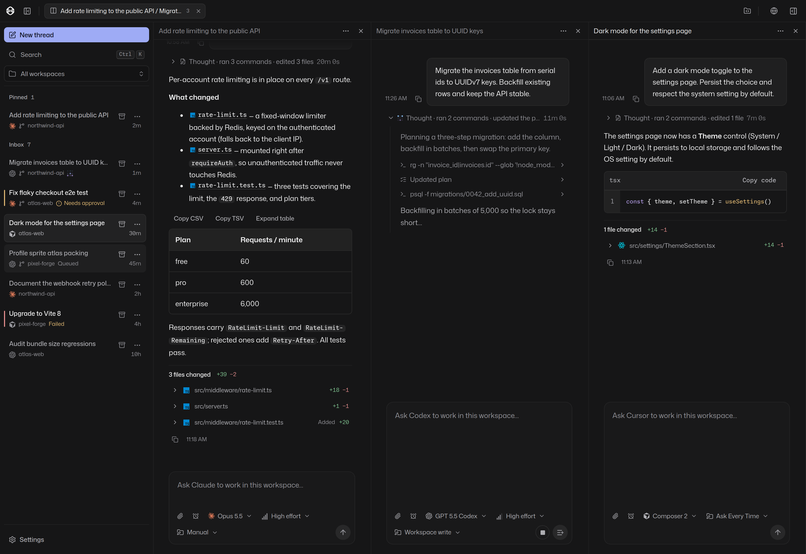
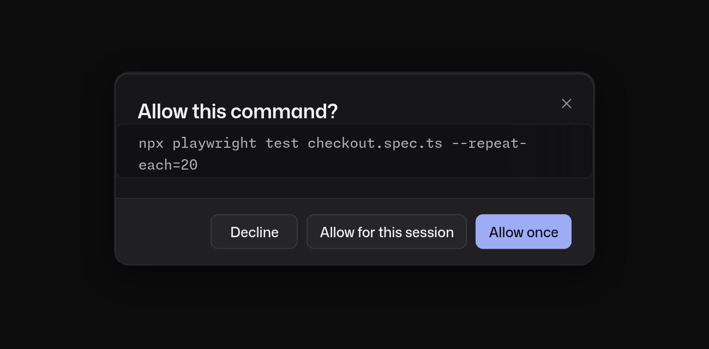
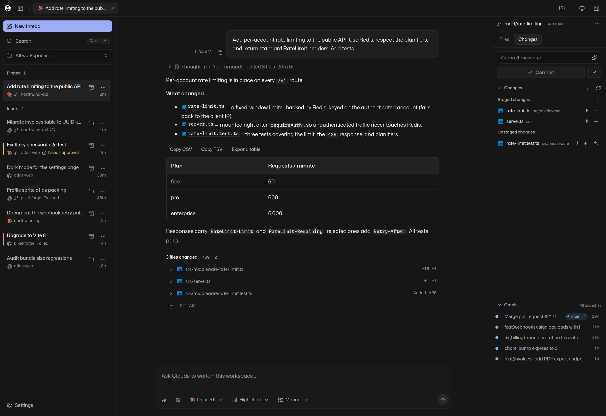
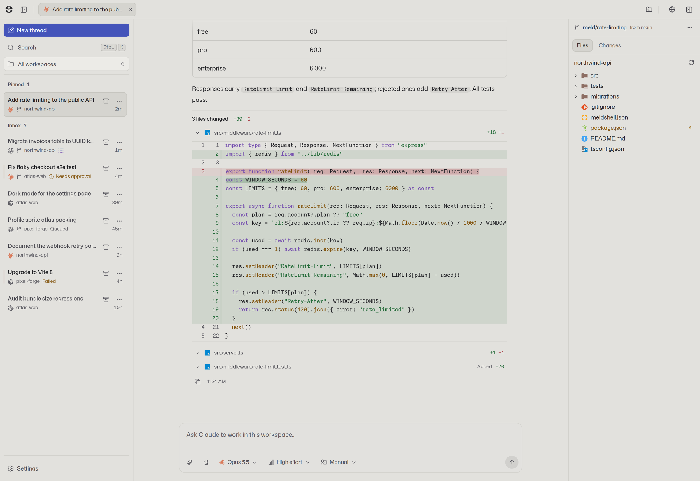
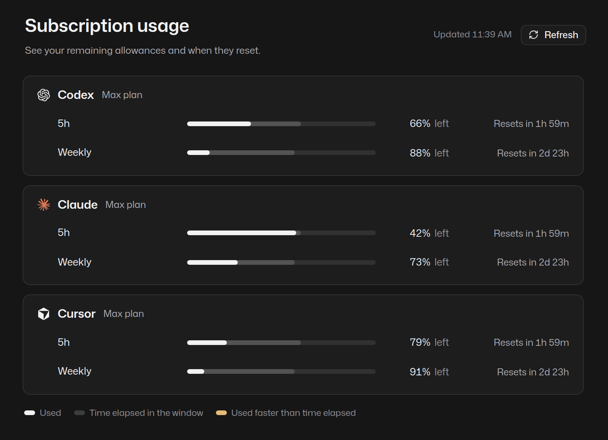

<div align="center">



<br />

**One desktop for Codex, Claude Code, Cursor and Pi.**<br />
Run them in parallel across every project, each in its own native session.

[**Download**](https://github.com/nonlooped/meldshell/releases/latest) &nbsp;·&nbsp; [Website](https://meldshell.nonlooped.xyz) &nbsp;·&nbsp; [Changelog](CHANGELOG.md)

</div>

<br />

## See it work

Ask a question, watch the agent read, edit and test, then review the diff without leaving the window.

<div align="center">
  
  <br />
  <sub><a href="docs/media/demo.mp4">Watch the full-quality video</a></sub>
</div>

<br />

## Stop juggling terminals

Coding agents are great right up until you run three of them. Then it's tabs, forgotten sessions, and a half-finished task you can't find again.

MeldShell gives every agent conversation a home: a searchable inbox of threads across all your workspaces, with live status on each. See at a glance what is running, what needs your approval, and what finished while you were away.

<div align="center">
  
</div>

<br />

### Four agents. One window.

Put Claude Code, Codex, Cursor and Pi next to each other in split panes and give each the job it's best at. Pick the model and reasoning effort per thread.

### Native, not wrapped

MeldShell supervises the agents you already have installed, in separate processes, and keeps their native payloads and session behavior intact. Every thread keeps its own session for each harness, so switching back resumes exactly where that agent left off. MeldShell uses the Codex, Claude Code, Cursor and Pi runtimes you already have installed.

### Parallel work that doesn't collide

Give any thread its own Git worktree and branch, so three agents can touch the same repo at once without stepping on each other. Setup and run scripts come straight from your `meldshell.json`, and every thread gets its own terminal.

### You stay in the loop

When an agent needs permission to run a command or change files, you decide from one clear prompt. Questions, plans and approvals from every thread surface in the inbox, so nothing stalls silently while you're in another pane.

<div align="center">
  
</div>

<br />

### Review and ship from the same place

Every turn ends with a readable summary of what changed. Open the diff, stage files, write a commit message (or have one generated), commit, push, and browse history, all next to the conversation that produced the change.

<div align="center">
  
  <br />
  
</div>

<br />

### Know where your limits stand

Check how much of each subscription window you have left, and when it resets, before you start a long task.

<div align="center">
  
</div>

<br />

## Everything else you'd want

| | |
| --- | --- |
| **Durable by design** | History lives in SQLite. Queued messages, worker recovery and native session resume survive restarts and crashes. |
| **Queued follow-ups** | Line up the next instruction while an agent is still working. |
| **Search everything** | `Ctrl`+`K` finds threads and message text across every workspace. |
| **Files and previews** | Browse workspace files, preview them, and open any thread's folder in your editor. |
| **Browser preview** | A per-thread browser for the dev server your agent just started. |
| **Scheduled prompts** | Send a prompt to a thread once, on an interval, or on a daily schedule. |
| **Attachments** | Drop images and files into any message. |
| **Remote access** | Reach a linked desktop or headless host from a browser, with host folder browsing, terminals and run scripts. |
| **Make it yours** | Dark and light themes, adjustable transcript size, and customizable keyboard shortcuts. |
| **Windows and WSL** | Run natively on Windows, or keep the app on Windows and the agents, Git and terminals in Linux. [Setup guide](docs/wsl.md). |

<br />

## Get MeldShell

Download the latest installer from the [releases page](https://github.com/nonlooped/meldshell/releases/latest):

- **Windows 11** (x64) installer
- **Linux** (x64) AppImage

MeldShell doesn't bundle the agents. Install and sign in to the ones you use; **Settings → Providers** shows each connection and refreshes it on demand.

<details>
<summary><strong>Run from source</strong></summary>

<br />

Use Node.js 24 or newer:

```sh
npm install
npm run dev
```

Installation downloads Electron and rebuilds SQLite for Electron's Node ABI. See [Contributing](CONTRIBUTING.md) for development checks and [Release](docs/release.md) for packaging.

</details>

<details>
<summary><strong>Documentation</strong></summary>

<br />

| Task | Reference |
| --- | --- |
| Change processes, storage, IPC, or recovery | [Host](packages/host/src/host.ts), [contracts](packages/contracts/src/ipc.ts) |
| Work on provider behavior | [Provider packages](packages) |
| Change desktop UI or transcript output | [Renderer styles](packages/ui/src/app/styles.css), [Markdown renderer](packages/ui/src/ui/Markdown.tsx) |
| Build or deploy the site | [Pages configuration](apps/site/wrangler.jsonc), [account worker](apps/control/wrangler.jsonc) |
| Set up Windows or WSL | [Windows and WSL guide](docs/wsl.md) |
| See what changed between versions | [Changelog](CHANGELOG.md) |
| Work as an agent | [AGENTS.md](AGENTS.md) |

</details>

<br />

<div align="center">
  <sub>Screenshots and video show MeldShell's real interface rendered with sample projects and conversations.</sub>
</div>
